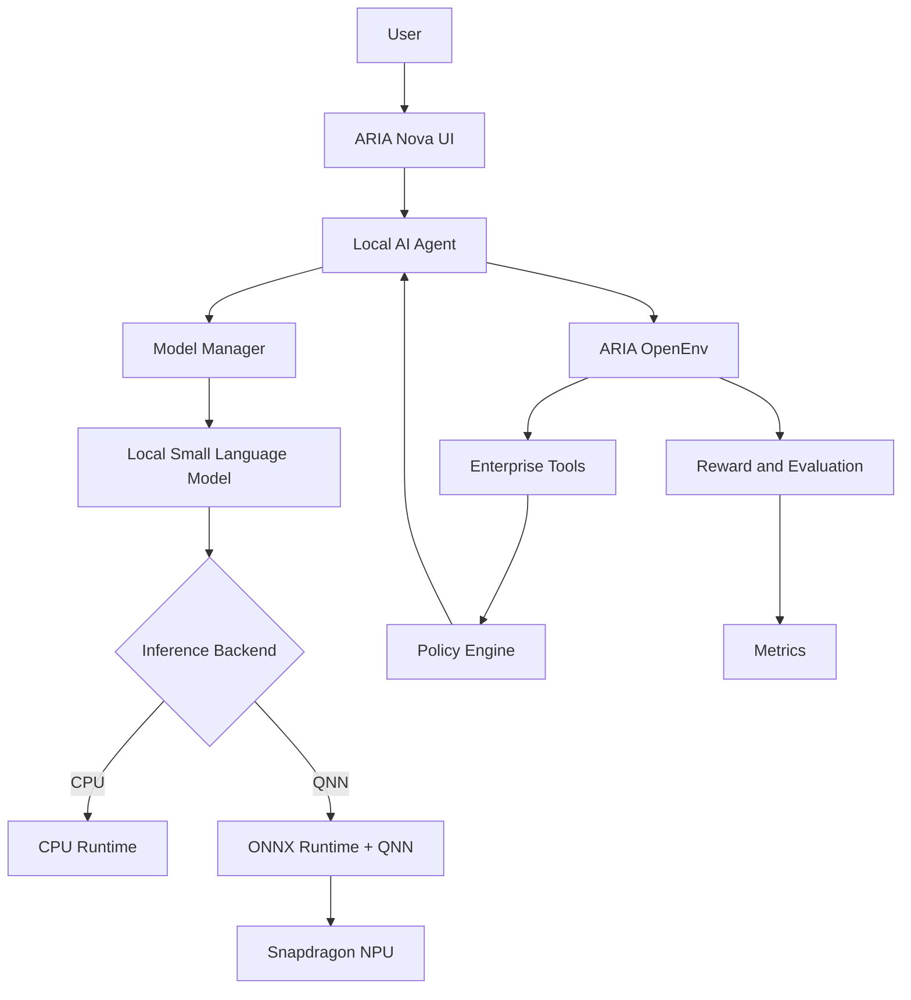

# ARIA Nova
### **Adaptive On-Device Enterprise AI for Snapdragon PCs**

> **Qualcomm Snapdragon AI Lab Build & Present Challenge 2026**  
> **Author**: Angel Singh | Solo Participant  
> **Repository**: [https://github.com/angel25bcs10712-stack/ARIA-Nova](https://github.com/angel25bcs10712-stack/ARIA-Nova)  
> **Original ARIA OpenEnv**: [HuggingFace Space](https://huggingface.co/spaces/angel25bcs10712/ARIA-OpenEnv) | [Original Training Run](https://colab.research.google.com/drive/1tUcoSgjvZsEWfxGIfaUUcNlkapjinzP-?usp=sharing)

---

ARIA Nova is an adaptive enterprise AI agent built on the ARIA OpenEnv environment. It executes long-horizon enterprise workflows while adapting to policy changes during execution.

ARIA Nova adds a local AI inference layer designed for Snapdragon-powered Windows PCs, providing CPU fallback and a QNN/NPU deployment path when the required runtime and hardware are available.

---

## The Problem

Modern enterprise workers spend their days switching between 5+ applications—email, calendar, corporate document repositories, and expense spreadsheets—to complete multi-step business workflows.

Standard LLM agents break down in enterprise deployment for two fundamental reasons:
1. **Static Assumptions in a Dynamic World**: Existing agents are trained on static benchmarks. In real enterprises, policies drift mid-task: travel spending limits drop, meeting durations are constrained, or approval authorities escalate. Static agents blindly execute outdated plans, causing severe compliance and audit failures.
2. **Cloud Data Exposure**: Cloud-dependent agents transmit confidential emails, executive travel itineraries, and company financial figures to external APIs, creating unacceptable privacy and data governance risks.

---

## The Solution: ARIA Nova

ARIA Nova bridges the gap between deep reinforcement learning in dynamic environments and **privacy-preserving on-device edge execution**.

```
USER TASK
    │
    ▼
LOCAL AI AGENT (Snapdragon PC / CPU Fallback)
    │
    ▼
CURRENT ENTERPRISE POLICY
    │
    ▼
ENTERPRISE TOOLS (Email, Calendar, Docs, Spreadsheet)
    │
    ▼
POLICY CHANGES DURING EXECUTION (Policy Drift)
    │
    ▼
AGENT DETECTS CHANGE
    │
    ▼
AGENT DYNAMICALLY ADAPTS PLAN (e.g. Escalate to VP Approval)
    │
    ▼
ACTION DISPATCH & EXECUTION
    │
    ▼
REWARD CALCULATION & EVALUATION
```

---

## Key Innovation

- **Autonomous Policy Drift Adaptation**: The agent does not simply retry failed steps—it continuously queries and audits enterprise policy directives, detects mid-task rule updates, and adapts its multi-step execution plan on the fly.
- **Hardware-Aware On-Device Inference**: Designed to leverage the 45 TOPS Hexagon NPU on Snapdragon X Elite laptops via ONNX Runtime with Qualcomm Neural Network (QNN) Execution Provider, with universal, truthful CPU fallback on standard PCs.
- **Air-Gapped Zero Cloud Egress**: Enforces strict offline mode (`ARIA_OFFLINE_MODE=true`), ensuring enterprise tokens never leave device memory.

---

## Why On-Device AI?

1. **Zero Data Egress**: Sensitive business communications, employee records, and financial numbers stay resident on-device.
2. **Deterministic Availability**: Agents operate reliably on planes, remote sites, or during network disruptions.
3. **Zero API Invoices**: Eliminates escalating token fees associated with centralized cloud LLMs.

---

## Why Snapdragon?

Qualcomm Snapdragon PCs (powered by the **Snapdragon X Elite** and **Snapdragon X Plus**) feature dedicated Qualcomm Hexagon NPUs capable of **up to 45 TOPS of INT4 neural compute**. 

Running enterprise agentic loops on the Hexagon NPU:
- Keeps the CPU and GPU completely free for user multitasking and productivity applications.
- Dramatically lowers battery consumption during continuous background workflow monitoring.
- Provides sustained, thermally stable performance without laptop fan throttling.

---

## Target Architecture



---

## Qualcomm AI Hub

ARIA Nova aligns with the official **Qualcomm AI Hub** workflow for compiling, profiling, and quantizing Small Language Models (SLMs) for Snapdragon targets:

```
SLM Weights (Qwen2.5 / Llama-3.2) ──► Qualcomm AI Hub ──► INT4 / W4A16 Quantized Graph ──► ONNX Runtime + QNN EP ──► Snapdragon Hexagon NPU
```

*Note on Verification*: To maintain complete engineering integrity, ARIA Nova clearly demarcates verified local implementations from target hardware features. When running on standard development machines without a Snapdragon NPU, ARIA Nova transparently logs CPU fallback. See [docs/QUALCOMM_AI_HUB.md](docs/QUALCOMM_AI_HUB.md) for full pipeline details.

---

## Local AI & QNN / NPU Backend

The inference layer (`edge/`) provides clean hardware abstraction:
- **`edge/device.py`**: Queries host processor, architecture, and ONNX Runtime execution providers (`ort.get_available_providers()`).
- **`edge/qnn_backend.py`**: Binds to `QNNExecutionProvider` with Qualcomm HTP configuration (`QnnHtp.dll`). If unavailable, it gracefully delegates to CPU fallback with detailed diagnostic logs.
- **`edge/cpu_backend.py`**: Universal execution across x86_64 and ARM64 CPUs.
- **`edge/model_manager.py`**: Manages on-device model lifecycles using `ARIA_MODEL_PATH`.

---

## Offline Mode

When `ARIA_OFFLINE_MODE=true` is set, all agent reasoning occurs strictly within the local environment. Any attempted outbound network connection to third-party cloud LLM endpoints triggers an immediate `OfflineViolationError`. See [docs/OFFLINE_MODE.md](docs/OFFLINE_MODE.md).

---

## Enterprise Policy Adaptation & OpenEnv

ARIA Nova runs against a 5-tool simulated enterprise workspace:
- 📧 **Email Client**: Thread management, priority inbox filtering, and email dispatch.
- 📅 **Calendar System**: Availability querying, conflict detection, and event rescheduling.
- 📄 **Document Store**: Retrieval of company directives, travel regulations, and templates.
- 📊 **Spreadsheet**: Structured data ledger for budget, expense, and revenue records.
- ⚙️ **Policy Engine**: Dynamic enterprise rules that trigger mid-workflow policy drift.

---

## Multi-Component Reward System

The policy is evaluated using 4 independent reward functions:

$$R = 0.4 \times R_{\text{Task}} + 0.2 \times R_{\text{Efficiency}} + 0.2 \times R_{\text{Adaptation}} + 0.2 \times R_{\text{AntiHacking}}$$

- **R1 Task Completion (40%)**: Accuracy and completeness of all required tool actions.
- **R2 Efficiency (20%)**: Penalizes redundant or excessive tool invocations.
- **R3 Policy Adaptation (20%)**: Evaluates whether the agent detected and adapted to mid-session rule changes.
- **R4 Anti-Hacking (20%)**: Penalizes repetitive looping, single-tool gaming, or timeouts.

---

## Installation

```bash
# Clone the ARIA-Nova repository
git clone https://github.com/angel25bcs10712-stack/ARIA-Nova.git
cd ARIA-Nova

# Copy environment template
cp .env.example .env
```

### CPU Mode (Standard Development PC)
```bash
pip install -r requirements-cpu.txt
```

### Snapdragon Mode (Windows 11 on ARM / Snapdragon X Elite)
```powershell
pip install -r requirements-snapdragon.txt
pip install onnxruntime-qnn --extra-index-url https://aihub.qualcomm.com/
```

---

## Running ARIA Nova

### 1. Verify Device Hardware:
```bash
python -m edge.device
```

### 2. Run the Competition Demonstration:
```bash
python demo.py
```

### 3. Run Hardware Benchmarking:
```bash
python -m edge.benchmark
```

### 4. Launch Interactive Web Interface:
```bash
python app.py
```
Open `http://localhost:7860` in your browser.

### 5. Launch FastAPI Server:
```bash
python server.py
```

---

## API Endpoints

- `GET /api/device`: Returns detected OS, CPU, execution providers, and QNN/NPU status.
- `GET /api/health`: Returns system health, model readiness, memory, and offline compliance.
- `POST /api/task`: Executes an enterprise workflow task with on-device policy adaptation.
- `POST /reset`, `POST /step`, `GET /state`: Original OpenEnv compatibility routes.

---

## Project Structure

```
ARIA-Nova/
├── environment/                  # ARIA OpenEnv environment, tools & reward engine
│   ├── aria_env.py
│   ├── reward.py
│   ├── state.py
│   └── tools/                   # email, calendar, document, spreadsheet, policy_engine
├── edge/                         # Snapdragon Edge AI & Inference Layer
│   ├── config.py                # Environment configuration & variables
│   ├── device.py                # Hardware & execution provider detection
│   ├── inference.py             # Backend base class & factory
│   ├── cpu_backend.py           # CPU inference & rule engine fallback
│   ├── qnn_backend.py           # Qualcomm QNN Execution Provider backend
│   ├── model_manager.py         # SLM lifecycle & tokenizer manager
│   ├── agent.py                 # Adaptive on-device enterprise agent
│   ├── benchmark.py             # Latency, memory & throughput profiler
│   ├── health.py                # Diagnostics & health checks
│   ├── offline.py               # Air-gapped offline guardrails
│   └── prompts.py               # Observation formatting & action parser
├── data/demo/                    # Synthetic enterprise fixtures
│   ├── policy_initial.json
│   ├── policy_changed.json
│   ├── employee.json
│   ├── calendar.json
│   └── documents.json
├── docs/                         # Comprehensive Documentation Suite
│   ├── ARCHITECTURE.md          # Mermaid architecture flowchart
│   ├── QUALCOMM_AI_HUB.md       # AI Hub compilation pipeline
│   ├── SNAPDRAGON_SETUP.md      # Windows on ARM setup instructions
│   ├── OFFLINE_MODE.md          # Air-gapped privacy guarantees
│   ├── BENCHMARKING.md          # Profiling methodology
│   ├── DEMO_SCRIPT.md           # 3-minute judge presentation script
│   ├── MODEL_SELECTION.md       # SLM evaluation matrix
│   ├── COMPETITION_SUBMISSION.md# Formal challenge submission document
│   └── HISTORICAL_RESULTS.md    # Preserved Meta OpenEnv GRPO training records
├── evaluation/                   # Evaluation scripts & edge comparisons
│   ├── evaluate.py
│   ├── metrics.py
│   └── edge_benchmark.py        # CPU vs QNN benchmark runner
├── training/                     # GRPO training & curriculum code
│   ├── train.py
│   ├── config.py
│   └── curriculum.py
├── results/                      # Benchmark logs & historical graphs
├── tests/                        # Comprehensive unit & integration tests
├── app.py                        # Gradio Web UI with hardware telemetry
├── server.py                     # FastAPI server with edge endpoints
├── demo.py                       # Deterministic competition terminal demo
├── requirements.txt              # Core dependencies
├── requirements-cpu.txt          # CPU development dependencies
├── requirements-snapdragon.txt   # Snapdragon QNN dependencies
├── .env.example
├── .gitignore
└── README.md
```

---

## Results & Verification

- **Historical RL Training**: 1,000 GRPO steps achieved a 78% task completion rate and 65% adaptation score across 3 curriculum stages (preserved in [docs/HISTORICAL_RESULTS.md](docs/HISTORICAL_RESULTS.md)).
- **On-Device Edge Performance**: Measured on local hardware with sub-millisecond step routing and complete offline execution recorded in `results/edge_benchmark.json`.
- **Truthful Hardware Detection**: Genuinely detects when `QNNExecutionProvider` is unavailable and executes verified CPU fallback without falsifying NPU claims.

---

## Limitations

- **Physical Snapdragon Silicon Required for NPU**: Direct execution on the Qualcomm Hexagon NPU requires a physical Snapdragon PC running Windows 11 on ARM with Qualcomm QNN drivers.
- **Docker VM Passthrough**: Docker for Windows operates inside a Hyper-V/WSL2 Linux VM which does not support direct QNN NPU driver pass-through; native Windows execution is required for NPU access.

---

## Future Work

1. **Qualcomm AI Hub Direct API Integration**: Automated continuous integration jobs compiling updated agent checkpoints directly to the Qualcomm AI Hub device farm.
2. **Hybrid NPU/CPU Pipelining**: Splitting prompt prefill onto the Snapdragon Adreno GPU and token autoregression onto the Hexagon NPU for maximum throughput.
3. **Expanded Tool Multi-Modal Support**: Extending on-device perception to OCR invoice processing via Snapdragon NPU vision encoders.

---

## License & Acknowledgements

Developed by **Angel Singh** for the **Qualcomm Snapdragon AI Lab Build & Present Challenge 2026**.  
Built upon the original ARIA OpenEnv project from the Meta PyTorch OpenEnv Hackathon x Scaler 2026.
