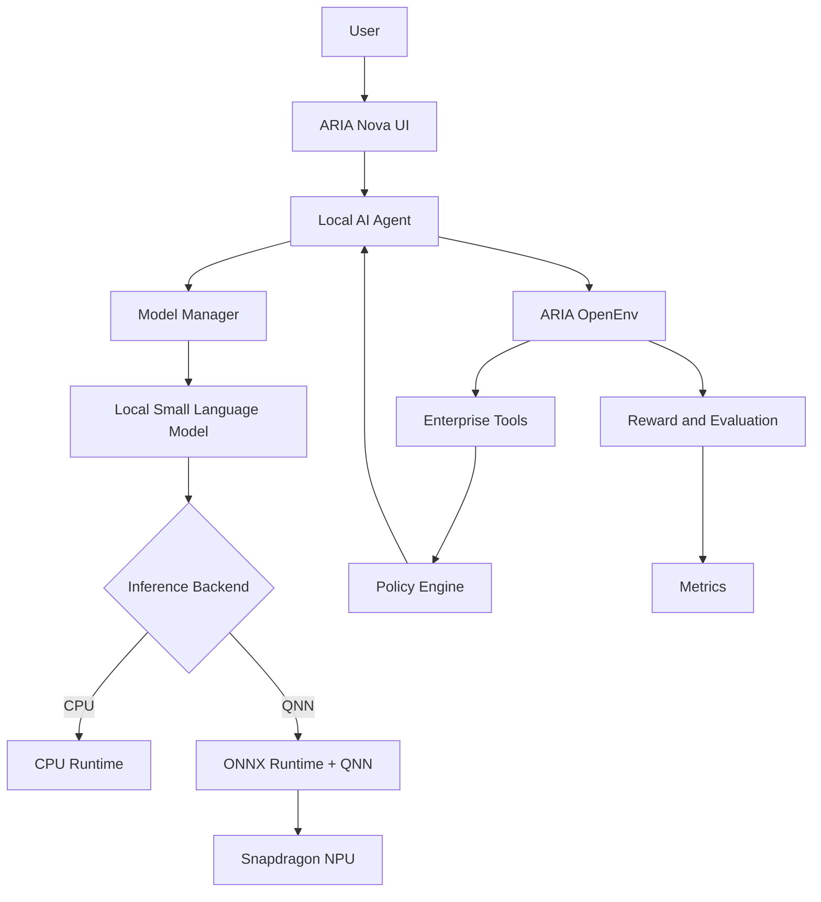

# ARIA Nova — System Architecture

ARIA Nova combines adaptive reinforcement learning policy execution from **ARIA OpenEnv** with an on-device edge AI inference stack optimized for **Snapdragon PCs** with CPU fallback.

---

## Architecture Diagram

---

## Component Deep Dive

### 1. User & ARIA Nova UI (`app.py`)
- Modern, reactive Gradio interface.
- Displays real-time hardware telemetry: host architecture, processor model, active backend (`CPU` or `QNN`), accelerator (`CPU` or `NPU`), and network status (`OFFLINE`).
- Exposes competition demo workflows, historical RL comparison graphs, and interactive multi-app action dispatchers.

### 2. Local AI Agent (`edge/agent.py`)
- Autonomous multi-step planner driving the enterprise environment.
- Inspects observations from all 5 enterprise tools.
- Evaluates active policies before each critical state transition.
- Dynamically interrupts execution when policy drift is detected, updates internal belief state, and re-routes actions through approved channels (e.g. escalating from direct manager to VP authorization).

### 3. Model Manager (`edge/model_manager.py`)
- Unifies local SLM loading, tokenizer configuration, and backend execution.
- Reads model path from `ARIA_MODEL_PATH`.
- Implements hardware-aware lifecycle management, automatically binding to Snapdragon QNN if available or CPU fallback.

### 4. Hardware Inference Backends (`edge/inference.py`)
- **CPU Backend (`edge/cpu_backend.py`)**: Runs ONNX Runtime with `CPUExecutionProvider` or HuggingFace local pipelines across standard development workstations.
- **QNN Backend (`edge/qnn_backend.py`)**: Targets Qualcomm Hexagon NPU via ONNX Runtime `QNNExecutionProvider` and `QnnHtp.dll`. Automatically activates on Snapdragon PCs and falls back with full diagnostic reporting on unsupported machines.

### 5. ARIA OpenEnv (`environment/`)
- A 5-tool enterprise workspace:
  - **Email Client**: Thread discovery, priority ranking, and dispatch.
  - **Calendar System**: Slot availability querying, scheduling, and conflict resolution.
  - **Document Store**: Policy directives, project specs, and quarterly data templates.
  - **Spreadsheet**: Structured corporate ledger with multi-field read/write capabilities.
  - **Policy Engine**: Dynamic enterprise rules with mid-task rule drift triggers.

### 6. Reward & Evaluation Engine (`environment/reward.py`, `evaluation/`)
- Multi-component reward formulation ($R1$ Task Completion, $R2$ Efficiency, $R3$ Policy Adaptation, $R4$ Anti-Hacking).
- Benchmarking profiler measuring latency, token throughput, and memory footprint.
